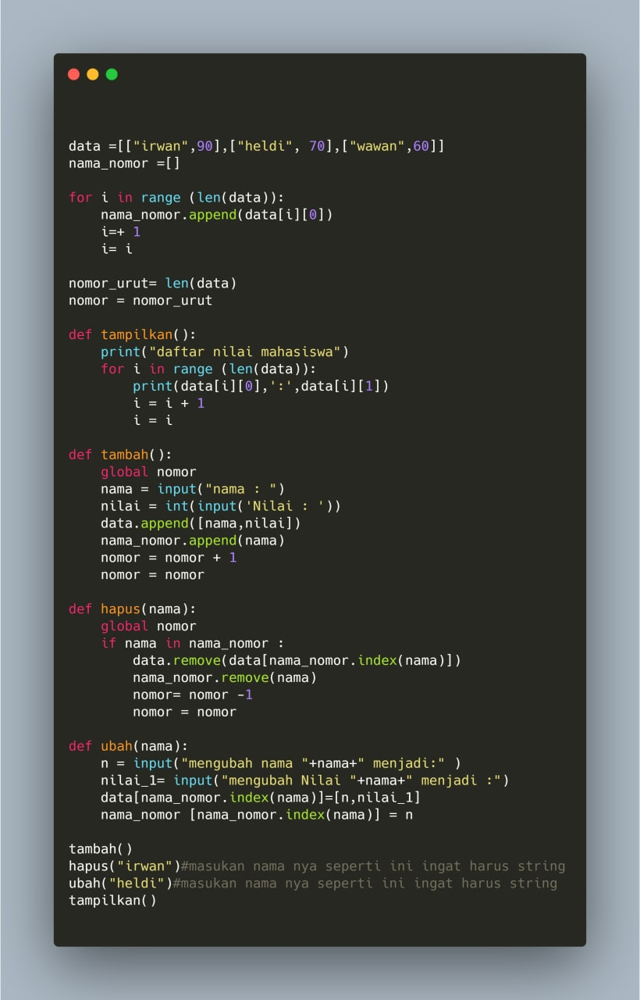

# ProjectUAS

# Dibuat untuk memenuhi jawaban UAS 

Nama : Andriansyah

Kelas : TI.20.B1

Matkul : Bhs.Pemrograman

1. Langkah pertama buatlah modul modulnya seperti ini
     
     

2. Setelah itu untuk mengakses nya gunakan contoh perintah seperti ini 
  
    

    

    

3. Buatlah sebuah folder untuk dijadikan package atau menyimpan kumpulan modul-modul

4. Setelah itu buat file __init__.py untuk mengakes modul modul nya

  

  

